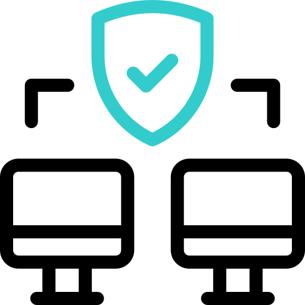

<html>
 <head>
  <meta charset="UTF-8">
  <meta name="keywords" content="Top-max17,top-max17">
   <meta name="viewport" 
    content=
     "width=device-width,
       initial-scale=1">
        <link rel="stylesheet" 
         href="style.css">
         <body>
        <h1>
✌Hi! there 
       i'm Top-max17
      
</h1>
<ul><li>internet issues

      <li>
Ethical hacker
</li><li>
cyber security</li>
</ul>   
       <ul></ul>
 </ul>

<h2>Funny:
 
plya video games🎮

 <h3>Contact me: </h3>
</strong>
  <blockquote><a href="https://www.instagram.com/topmax_17?igsh=YzljYTk1ODg3Zg==> "></a>
 
            </blockquote>
</h5>
</blockquote></body></html>

